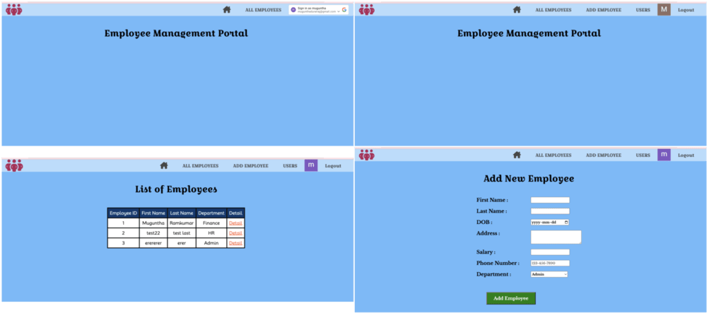

# Employee Management Portal
## Project Description :
The Employee Management Portal is a web-based tool that assists in maintaining employee information, evaluating employee performance, updating employee records, and deleting employee information.
# Planning Material
The planning materials are available on the Trello board linked [here](https://trello.com/b/D5Gq5U0C/employee-management-portal), which contains the project's user stories, ERD, and wireframes.
## Installation : [Employee Management Portal](https://employee-management-software.fly.dev/)
## Technologies && Database :

## Resources :
- Google Chrome
- W3Schools
- MDN web Docs
- [Google fonts](https://fonts.google.com/specimen/Libre+Baskerville)
- [Favicon](https://encrypted-tbn0.gstatic.com/images?q=tbn:ANd9GcRfdu_cMzmPjjvoTtzsqtNpKNTzabogAiqdDA&usqp=CAU)
- [Fontawesome](https://fontawesome.com/icons/people-group?f=classic&s=solid&an=beat&pc=%23591c4e)
- Lunapic
## Tools and Services :
  
 
 
## User instruction
- Just click on the provided hyperlink in the installation field.
- Your web browser will open the Employee Management Portal.
- Non-logged-in users can access a list of employees and their basic information by clicking 'All Employees' and then selecting 'Detail' to view additional information.
- You can search for employees from the list using a filter.
- A user can sign up by clicking on the sign-up area and providing an email address and a password.
- As a logged-in user, you can see the following options: 'All Employees','Add Employees','Users' and 'Log Out'.
- As a signed user, you can add an employee by going to the "Add Employee" form, filling in the required fields, and clicking the "Add Employee Button."
- A signed user can access a list of employees and their basic information by clicking 'All Employees' and then selecting 'Detail' to view additional information.
- If a signed user adds an employee, they can only access the 'Edit Employee' and 'Delete Employee' buttons to modify or delete the employee's details.
- If a signed user adds an employee, they will only have access to the 'Reviews' section and can create, read, and delete reviews.
- As a signed user, you can view the list of users in the 'Users' field.
- As a signed user, you can click the 'Logout' button to log out of the application.
## Next Steps / Icebox :
- Add up and down arrow buttons to the header of the employees list. Click these buttons to sort the list of employees in ascending and descending order.
